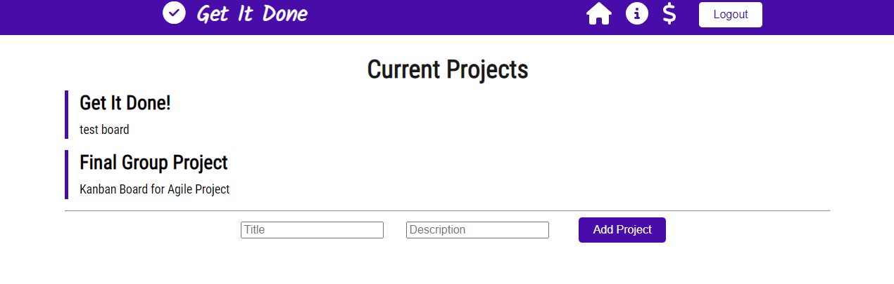

# Get It Done

## Table of contents

- [Overview](#overview)
  - [The challenge](#the-challenge)
  - [User Story](#user-story)
  - [Acceptance Criteria](#acceptance-criteria)
  - [Screenshot](#screenshot)
  - [Links](#links)
- [My process](#my-process)
  - [Built with](#built-with)
  - [Dependencies](#dependencies)
  - [Continued development](#continued-development)
  - [Useful resources](#useful-resources)
- [Authors](#authors)
- [Acknowledgments](#acknowledgments)


## Overview

### The challenge

The minimum viable product (MVP) of this team project is to create a MERN-stack single-page application. Our app, GET IT DONE, Kanban Agile Project Management system. It uses MongoDB for the back end database and has a GraphQL API. React is used for the front end and Express.js/Node.js for the routing and server. 

The project implements JWT to authenticate users.  The project is deployed through Heroku and uses Mongoose as the ORM. Material UI is the CSS framework used for polished user interface. We implemented a payment platform using Stripe to receive donations.

### User Story

AS AN employee working on agile projects
I WANT a Kanban board
SO THAT I can track projects/tasks through stages of Backlog, Todo, In Progress, and Done 


### Acceptance Criteria

Use React for the front end
Use GraphQL with a Node.js and Express.js server
Use MongoDB and the Mongoose ODM for the database.
Use queries and mutations for retrieving, adding, updating, and deleting data
Protects API keys and sensitive information with environment variables
Deploy using Heroku 
Has JWT authentication
Has a polished UI and is mobile friendly


### Screenshot




### Links

- Solution URL: [Git Hub](https://github.com/anuvytla/GetItDone)
- Live Site URL: [Heroku](https://get-it-done-kanban-pm.herokuapp.com/)

## Our process

### Built with

- React
- Material UI
- GraphQL
- MongoDB/Mongoose
- Heroku


### Dependencies

- bcrypt
- dotenv
- Express.js
- JWT authentication
- MongoDB
- mongoose


```GraphQL
	Mutation: {
		addProfile: async (parent, { name, email, password }) => {
			const profile = await Profile.create({ name, email, password });
			const token = signToken(profile);

			return { token, profile };
		},
```


### Continued development
Include a notification Center to provide updates on various task
Functionality to assign task to specific users


## Authors

- Professional Portfolio - [Anusha Vytla](https://www.your-site.com)
- Github - [anuvytla](https://github.com/anuvytla)
-------------------------------------------------------------

- Professional Portfolio - [Devi Nallammai](https://rmdn321.github.io/homework-2/)
- Github - [rmdn321](https://github.com/rmdn321/)
--------------------------------------------------------------

- Professional Portfolio - [Robert M Greene](https://monkonjay.github.io/Portfolio/)
- Github - [Monkonjay](https://github.com/Monkonjay)
--------------------------------------------------------------

- Professional Portfolio - [Max McLaughlin](https://lafflin.github.io/Portfolio/)
- Github - [Lafflin](https://github.com/lafflin)


## Acknowledgments
This project includes many technologies not covered in our course. Technologies like normalize.css, React Draggable, Tippy were implemented due to dedication of our team members. We would like to acknowledge each other, our instructional staff, and of course, the many develpers whose works are available open source to help us build our imaginations.  

  
